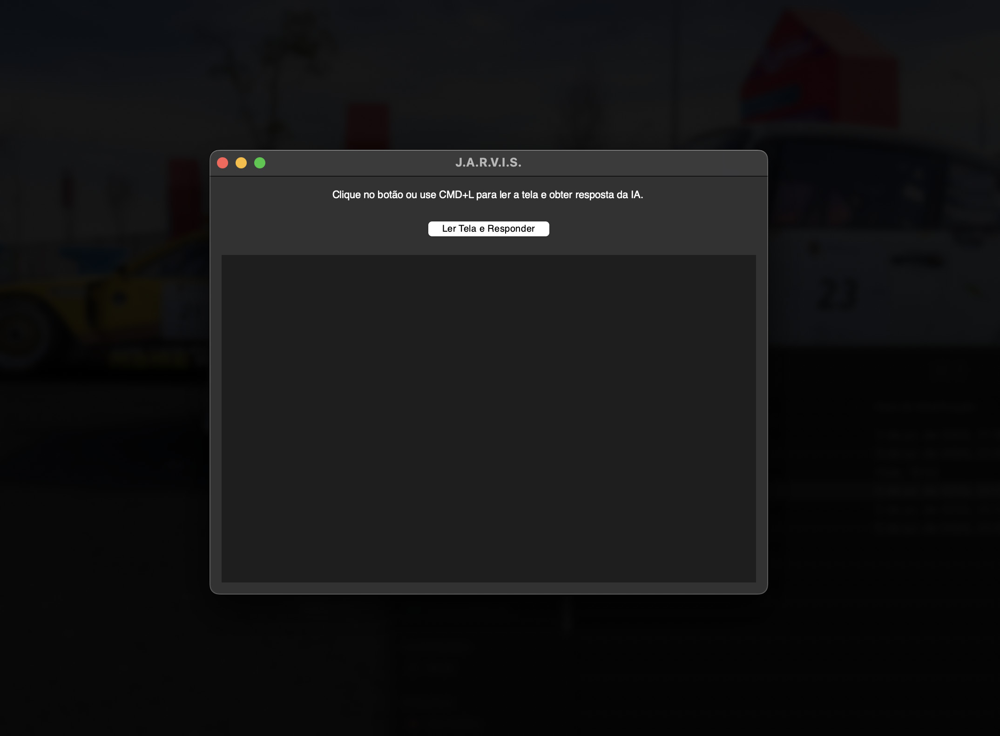

# J.A.R.V.I.S. – Leitor de Tela com IA 🎯

### 🧠 Descrição
Aplicativo desktop em Python que captura o conteúdo da tela, extrai texto via OCR e envia para a IA Gemini, retornando respostas inteligentes, resumos ou explicações — ideal para estudos, trabalho e acessibilidade.

---

### ✅ Funcionalidades
- 📸 Captura da tela via PyAutoGUI + OCR (Tesseract).
- 🎯 Reconhecimento automático de perguntas ou conteúdos gerais.
- 🧠 Geração de respostas/resumos com Gemini 1.5 Flash (Google).
- 🪟 Interface gráfica em Tkinter com botão e atalho `CMD + L`.
- 🧹 Histórico limpo automaticamente ao encerrar o programa.
- 🔤 Tipografia ajustada para melhor legibilidade.

---

### 🎬 Demo




---

## 🚀 Como executar

1. **Clone este repositório:**

```bash
git clone https://github.com/willianbarbosadeandrade/J.A.R.V.I.S.git
cd J.A.R.V.I.S
```

2. **Instale as dependências:**

```bash
pip install -r requirements.txt
```

3. **Configure sua chave da API Gemini:**

Crie um arquivo `config.py` com o seguinte conteúdo:

```python
# config.py
GEMINI_API_KEY = "sua-chave-aqui"
```

Você pode usar o `config.py.example` como base.

4. **Execute o aplicativo:**

```bash
python main.py
```

---

## 🧪 Tecnologias utilizadas

- **Python 3.13**
- **OCR:** pytesseract + PIL
- **IA:** Gemini 1.5 Flash (Google)
- **GUI:** Tkinter
- **Captura de tela:** pyautogui
- **Clipboard:** pyperclip

---

## 📁 Estrutura

```
J.A.R.V.I.S/
├── main.py
├── config.py.example
├── requirements.txt
├── .gitignore
├── DEMO.png
├── demo.gif
└── README.md
```

---

## 👤 Autor

Desenvolvido por **Willian Barbosa**  
🔗 [LinkedIn](https://www.linkedin.com/in/willianbarbosadeandrade)  
📬 willianbarbosadeandrade@gmail.com

---

## 📄 Licença

Este projeto está sob a licença MIT.
